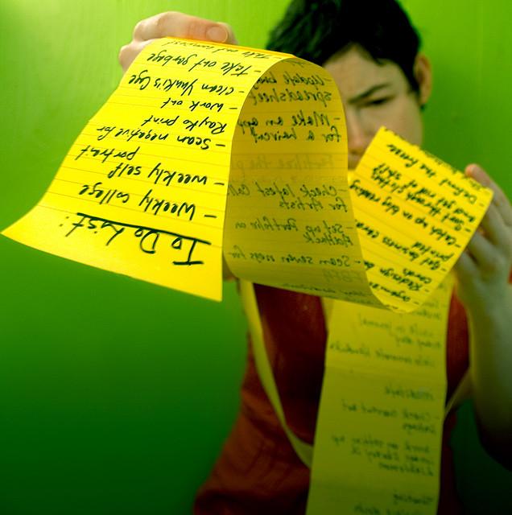
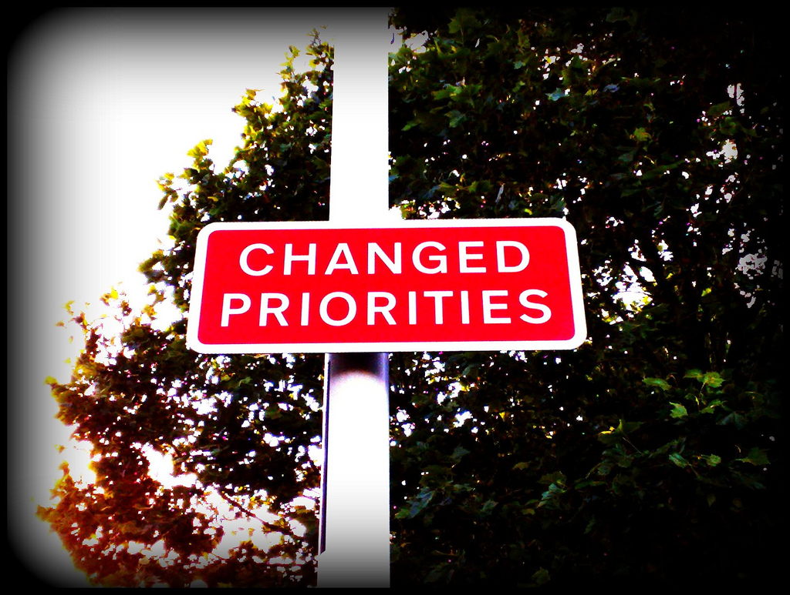

!SLIDE
# Getting Things Done #

## by Tony Daly
 
### Leap Inspirational Retreat
### December 2010

!SLIDE center

# With #

!SLIDE bullets incremental small
# Getting Things Done (GTD) #

* Move tasks out of the mind by recording them externally
* Mind is freed from the job of remembering everything 
* Can concentrate on actually performing those tasks

!SLIDE bullets incremental
# Things

* Is great for recording tasks
* Tasks don't get lost

!SLIDE center
# What happens when our lists get too long?!

!SLIDE

# How many items do you have in your inbox?

!SLIDE center

# Prioritise #

!SLIDE bullets

# Prioritise #

* We've made the first step
* What do we **need** to do?

!SLIDE bullets

# Prioritise #

* Now we need to make the next step
* What do we need to do **first**?
