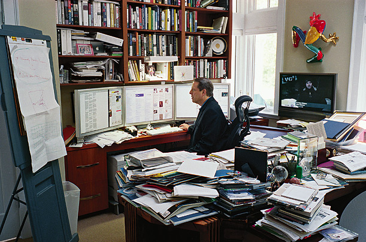

!SLIDE

# Why do we need to be organised? #

!SLIDE center

# Otherwise we won't get anything done! #

!SLIDE bullets

# Organisation

* More efficient & productive
* More likely to reach our goals

* Less likely to be overly busy and stressed

!SLIDE bullets

# Perpetual Busyness #

* Focus on short term tasks
* Kills creativity - our greatest asset