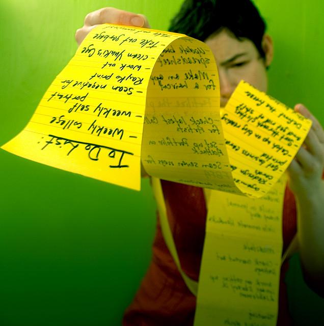

!SLIDE

# Why do we need to be organised? #

!SLIDE center

# Otherwise we won't get anything done! #

!SLIDE bullets

# Organisation

* More efficient & productive
* More likely to reach our goals

* Less likely to be overly busy and stressed

!SLIDE bullets

# Perpetual Busyness #

* Focus on short term tasks
* Kills creativity - our greatest asset

!SLIDE bullets incremental
# Things

* Is great for recording tasks
* Tasks don't get lost

!SLIDE center
# What happens when our lists get too long?!

!SLIDE

# How many items do you have in your inbox?

!SLIDE bullets

* How do you decide what's important?
* How do you decide which tasks will get us closer to our goals?
* How do you decide which tasks to ignore?!

