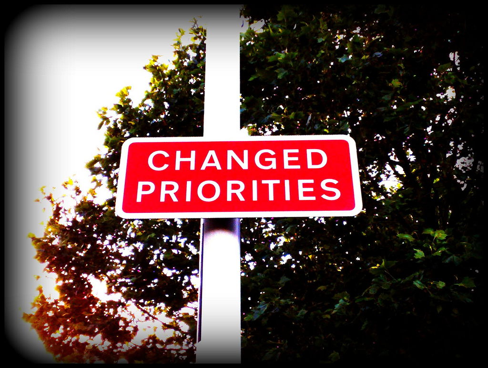
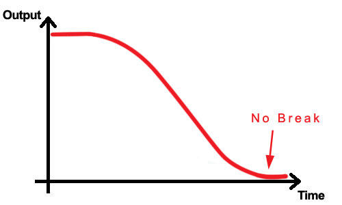
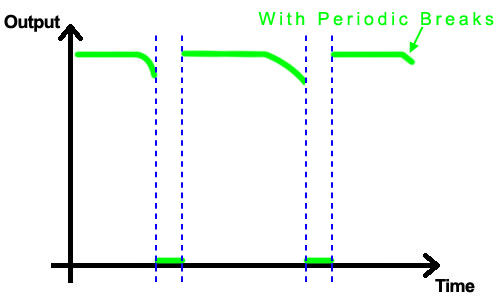

!SLIDE center

# Prioritise #

!SLIDE bullets

# Prioritise #

* We've made the first step
* What do we **need** to do?

!SLIDE bullets

# Prioritise #

* Now we need to make the next step
* What do we need to do **first**?

!SLIDE bullets
# Morning Scrub

* What is important today?
* Helps to give you an internal priority scale

!SLIDE bullets

# Organise all your existing tasks into three buckets:

* **Today:** must be completed today.
* **Next:** not today. Later.
* **Never:** never going to do this, get rid of it.

!SLIDE bullets
# Productivity Minimalism

* No need to assign priorities. 
* This list gets scrubbed each morning
* Make real-time decisions regarding scheduling tasks
* Complicated systems require lots of time to maintain, less time to get work done!

!SLIDE bullets
# Inbox

* Any idea/task/thing that is worth remembering, but can't be acted on immediately (will derail the productivity train!)
* Occasionally you'll want to act on these, but ask yourself:
	*"Is moving on this new thing more important than finishing what I'm doing right now?"*
	
!SLIDE bullets small
# Evening Scrub

* After work, after dinner, before sleep
* Scrub the inbox into the Next bucket
* Scrub unfinished items in Today bucket: why didn't this get done?
* Put it back in the Next bucket, or...delete it

!SLIDE bullets small
# Nuke it from orbit

* If the task is important it'll find its way back to your Inbox
* You will never complete everything you should!
* Learn the art of what *not* to do
* It was urgent this morning, but I never got to it. Does it matter?
* Priority is relative

!SLIDE 

# What makes a productive person? #

!SLIDE bullets incremental

* Lots of work in a short span of time?
* Lots of *high impact* work in a short span of time!

!SLIDE center

# You can do hundreds of tasks in a day, but if none of them produce any impact it was a waste of time!

!SLIDE bullets

# 1: Throw away the unimportant

* If something has been in your list for a long time and hasn't been done, it might be time to throw it away (or just get it done!)

!SLIDE bullets incremental smaller

* Why are you doing this? - *Who benefits?*
* What problem are you solving? - *Is this a real problem?*
* Is this actually useful? - *It's easy to confuse enthusiasm with usefulness*
* Are you adding value? - *Adding something is easy, adding value is hard.*
* Will this change behaviour? - *Don't add something unless it has a real impact*
* Is there an easier way? - *More often than not*
* What could you be doing instead? - *What can't you do because you're doing this*
* Is it really worth it?

!SLIDE bullets

# 2: Take regular breaks

* Being productive does not mean working non-stop
* Non-stop perpetually busy work makes you *less* productive!
* Law of diminishing returns
* Work smart not hard

!SLIDE center

### Output decreases over time when there are no breaks

!SLIDE center

### With breaks, the output can be maintained at a consistent high

!SLIDE

# Rest enables you to get more done!

!SLIDE

## "If you're constantly staying late and working weekends, it's not because there's too much work to be done. It's because you're not getting enough done at work. And the reason is interruptions."

<em>Interruption is the enemy of productivity - Rework</em>

!SLIDE bullets incremental

# 3: Remove distractions

* I love you all, but you're *very* distracting
* Productive in the zone
* Being in the zone requires avoiding interruptions
* Email rather than face-2-face
* We need a period of alone time
* Shut up and work

!SLIDE 

## The tool that you're using is unimportant. Whatever system you use you must use it all the time.

!SLIDE
# Questions